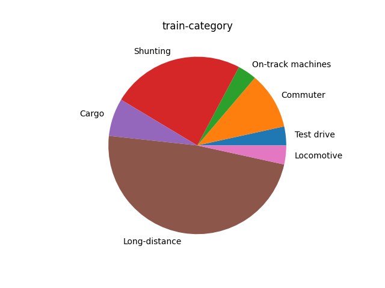
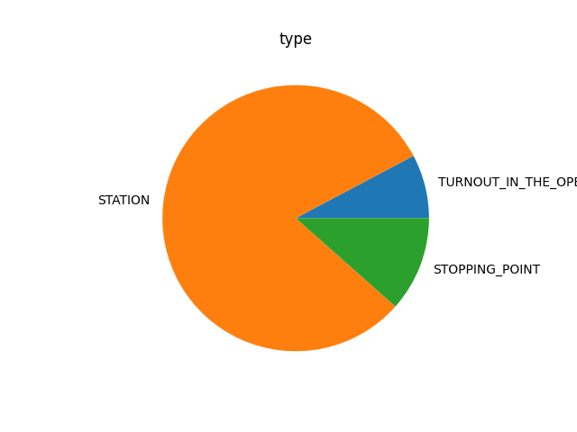
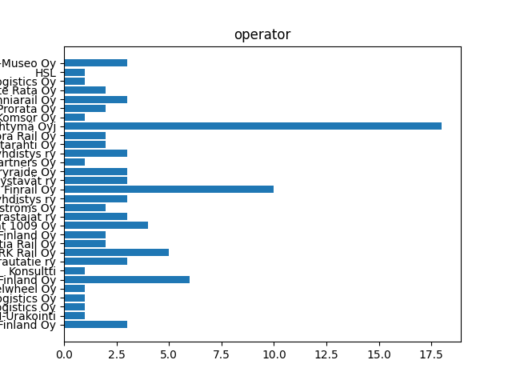

# Railway data batching pipline and visualization

## Overview
- Data source: Digitraffic https://www.digitraffic.fi/
- Data digestion: `PySpark`
- Visualization: `Matplotlib`
- Database: `PostgreSQL`
- Datalake: `AWS S3 bucket`
- Orchestation: `Airflow` 

Project uses `PySpark` for fetching Digitraffic API data, then flattening them  and load in local `PostgreSQL` database. Visualising data to bar or pie plots by `Matplotlib`. And finally, load those graph under format .png to `AWS S3 bucket`. All those processes are ochestrated by local `Airflow`.

### Images






## Process

Dag contains totally 3 tasks: **etl_pipeline**, **visualization**, **upload_S3** and is executed every Monday 

- **etl_pipeline**:
    - Pull API from **Digitraffic** 
    - Load those data in JSON format to Dataframe
    - Flatten complicated, nested Dataframe by `flatten_df` function 
    - Load DataFrame to local PostgresSQL database 

- **visualization**:
    - In **visualiztion.py** file and is executed by `BashOpertor` 
    - Query data by using `Pandas`
    - Plot data into bar, or pie by `Matplotlib` through `plot` function

- **upload_S3**:
    - Connect to bucket by `boto3`
    - Upload graph to bucket in format png 

## Problems and Notes - Important

- **Airflow**: 
    - Set up `AIRFLOW_HOME` environment variable as the path to project folder

    - Config `parallelism`, `max_active_tasks_per_dag` & `max_active_runs_per_dag` to optimize execution speed and computer resources and also change `executor` to `LocalExecutor` instead of `SequentialExecutor` as default in **airflow.cfg** file

    - Trying to use **TaskFlow API** - decorators of airflow to obtain cleaner code, but it now only supports `Python Operation` only
    
    - Using `airflow webserver` & `airflow scheduler` command to run airflow in CLI

- **Postgres database**: 
    - Default of airflow database is SQLite so want to change it to Postgres, must connect it to local database
    - Set up connection to local database through **Connections** in Airflow GUI

    - Config `sql_alchemy_conn` to local databse in **airflow.cfg** file, require `psycopg2` module in addition

- **PySpark**: 
    - Set up `JAVA_HOME` and `SPARK_HOME` environment variables
    - Set up connection through **Connections** in Airflow GUI
    - Install `pgJDBC` for loading data into Postgres database

- **Requests**:
    - Set up `no_proxy` environment variable to `*` for able to execute pulling API from Airflow, line 15 in **fetching_api.py** file in **dags** folder

- **Matplotlib**:
    - Cannot execute plotting data from Airflow because Airflow tasks have no access to computer graphical card, instead of setting and config computer, using `BashOperator` to execute the file that contains visualisation code - **visualization.py** file

- **AWS S3**: 
    - Instead of using `S3Hook` from Airflow by set up connection through **Connections** to bucket, using `boto3` module still give the same output
    - Set up **Permision** to allow public access & add **Policy** PutObject in AWS S3 web to success loading graph

- Other: 
    - I using **Mac M1** so here is some problems you may meet:
        - Chip incompatible, part of error message: *... incompatible architecture have x86-64 ...* -, solved by open info of your **Terminal** and check to **Open in Rosseta**

        - `Matplotlib` got error, which is caused by especially `Pillow` dependency, and just normal reinstalling `Matplotlib` cannot solve the promblem. Need to manually uninstall it dependency then reinstall it. 
        ```
        pip uninstall pillow
        pip uninstall numpy
        pip uninstall wordcloud
        pip uninstall matplotlib 
        pip uninstall pyparsing
        pip uninstall kiwisolver
        pip uninstall python-dateutil
        pip uninstall cycler
        pip uninstall packaging
        pip uninstall fonttools
        pip uninstall contourpy
        pip uninstall six
        ```

        - The error message is *Pyspark: Exception: Java gateway process exited before sending the driver its port number*, cause of problem maybe:
            - Not correctly set up `JAVA_HOME`, install Java manually and through **Brew** give different paths
            - Java update version so the version in the path is not there lead to computer cannot find it
            - Not correctly set up `SPARK_HOME` or `HADOOP_HOME`